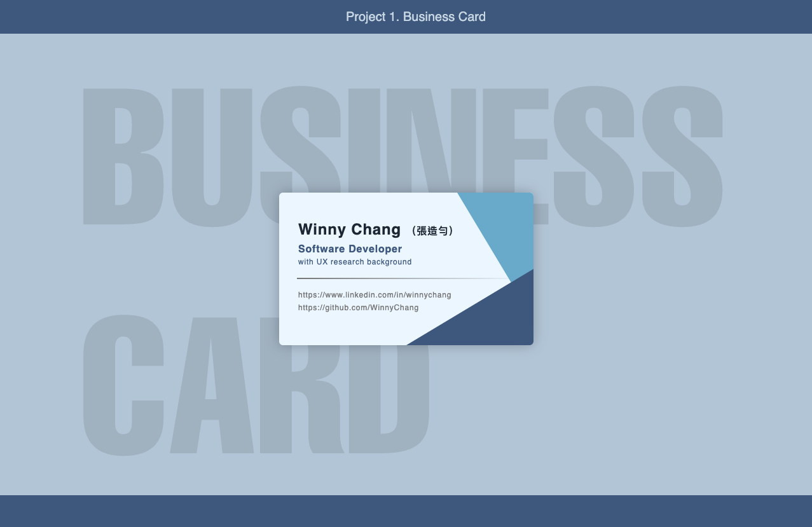

# Project 1. Business Card

## Overview
This is my first front-end development project, where I created a digital business card using HTML and CSS. The goal was to design a clean and visually appealing layout that highlights essential information about me.

**Live Demo:** [View on CodePen](https://codepen.io/WinnyChang-Yun/pen/azoExzJ)

## Tech Stack
- **HTML**: Structured the content of the business card.
- **CSS**: Styled the layout, typography, and design elements.

## Features
- Professional and modern design.
- Subtle background shapes and shadows for a polished aesthetic.
- Clean typography and color scheme for readability.

## Lessons Learned
- Structuring content with semantic HTML.
- Styling layouts using CSS.
- Using CSS properties like `clip-path`, `box-shadow`, and gradients to create visually engaging designs.

## Future Improvements
- Add interactivity using JavaScript (e.g., hover effects or animations).
- Implement responsive design techniques to adapt the layout for different screen sizes.

## Author
Winny Chang
